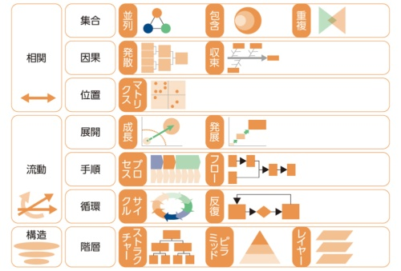

# 学習効率(短時間高生産)を達成するための学習方法

## 1 なぜ学習効率を上げたいか

### ① 学んだ内容を無駄にしない

→ 人は 1 ヶ月後に 82%忘れるが、忘れたままにしていたら投下した時間が無駄になり人生の効率が悪い

### ② やりたいことを全てやるために、学習効率を上げる

→ やりたいこと、成し遂げたいことはたくさんあるのに、達成できてないのは頭と時間の使い方をミスったため。以下のメソッドで勉強をすれば「やりたいことを全てやれる人生」になる

## 2 短時間高生産を成すための人間の脳構造の定義、それに基づいた勉強原則

### ① 人間の原則

記憶は、インプットしたときでなく思い出したときに定着する

### ② 勉強原則

「分散学習」とは、学んだ知識を少し時間を置いてから復習すること。

# 3 スプリントごとに”短時間高生産”を生み出すやり方

## ① 勉強を開始したい

ポモドーロタイマーのスイッチオン

スマホの電源を切る

机を片付ける(ものを片付けたり拭いたり)

服を勉強用の服に着替える(スーツ)

耳栓をつける(勉強用)

今からする作業の目的やメリットを〜に記載・イメージする

## ② 勉強中(短時間高生産で)

25 分の間に別の作業をした時に正の字で数え、集中指数を計測する。(DaiGo)

黙読より音読(黙読より 1.25 倍)

学んだ内容を復習するために、メモやノートに箇条書きで記載し(自分の言葉で再定義する)、20 分後に ③ 復習の時に思い出す作業をする

## ③ 復習

を使って図でまとめる

箇条書きした内容について説明をする

くまちゃんに教える(人に教えると頭を整理できるので効率がいい)

## ④ 瞑想

集中力を上げられるメリットがある
思考を柔軟にする

### Q. 集中したい

水を飲む

瞑想をする

昼寝 → 歩くのサイクルをする

### Q. 頭の回転を上げたい

水飲む

HIIT

スピルリナ

昇降式の机で立ったり座ったりする

### Q. やる気がない時

(やる気というものは存在せず、手を動かすことによって作業興奮を喚起し結果的にやる気が出る)

### Q. パフォーマンス指数が低い時

とりあえず最低限でいいので、ポモドーロレールの通りに作業をして成果を出すことを意識する
